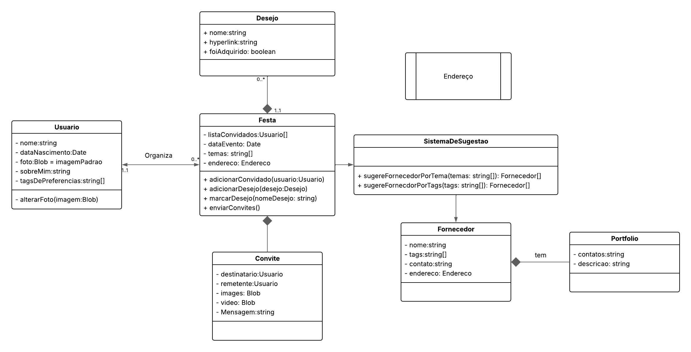

# Diagrama de Classes

 Autores: <a href="http://github.com/brenob6">Breno</a> e <a href="https://github.com/HauedyWS" target = "_blank">Hauedy</a> e <a href="https://github.com/Ninja-Haiyai">Matheus</a> 

## Histórico de Versão

| Versão | Data | Descrição | Autor(es) | Revisor(es) |
| ------ | ---- | --------- | --------- | ---------- |
| `1.0`  |03/05/2025 | Adicionado diagrama UML | Autor | Breno, Hauedy e Matheus |
